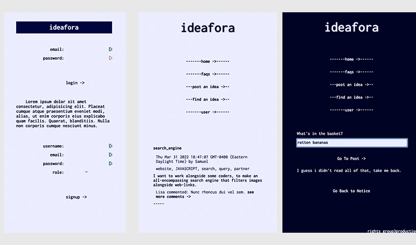

# ideafora 1.0
  

  

 [deployed heroku website](https://ihaveanideafora.herokuapp.com/)

  ## OVERVIEW:
   This is a mobile friendly website that organizes user generated ideas in a format that allows other users to give feedback and collaborate. As people who have ideas, we want to share them. As people who code, we want to find projects to work on that would interest us. And as bystanders, we want to see the breadth and depth of ideas out there. This solves a market problem in terms of interest and compatability with coding projects and coders - matching coders with projects that are inherently motivational and thus creating better code and better projects. A site is only as good as its users, so setting 'the vibe' and guiding input is important to building the community that you want to cultivate, both in influencing existing users, and attracting interesting new users.

  ## Table Of Contents:
  [Installation](README.md#installation) 
  [Usage](README.md#usage) 
  [Tests](README.md#tests) 
  [Credits](README.md#credits) 
  [Questions](README.md#questions) 
  [License](README.md#license) 

  ## Installation
  As a fully functional website, the interface should be as user friendly as possible. On the back end, the site relies on bcrypt, cloudinary, connect-session-sequelize, dotenv, express, express-handlebars, express-session, mysql2, and sequelize, as well as the myriad dependancies that those rely upon.

  ## Usage
  As the site gains visitors, we will learn who the users are and what the main draws of the site are, and the site should be redeveloped accordingly.

  ## Tests
  This website was not tested on any animals other than humans. Insomnia was involved on several levels.

  ## Credits
  Huge huge thanks to Jordan Schnur, the TA who helped us through the hairy bits, to all the other TAs, Tutors and Diego Struk Jaia, aka ThaProf, as well as the many many coders who made the applications and dependencies upon which this relies. 

  ## Questions
  Group 3: 
  [Lisa Jean,](https://github.com/jeanl87) 
  [Janelle Phalon,](https://github.com/janellephalon) 
  [Claudia Davis,](https://github.com/ccd330) 
  [Adam Payne,](https://github.com/MrSumada) 
  and [Becket Bowes](becketbowes@gmail.com)
  [Github Page](https://github.com/becketbowes/ihaveanideafora)

  ## License
  [MIT Open License, Sun Apr 03 2022 02:41:24 GMT-0400 (Eastern Daylight Time)](https://opensource.org/licenses/MIT)
